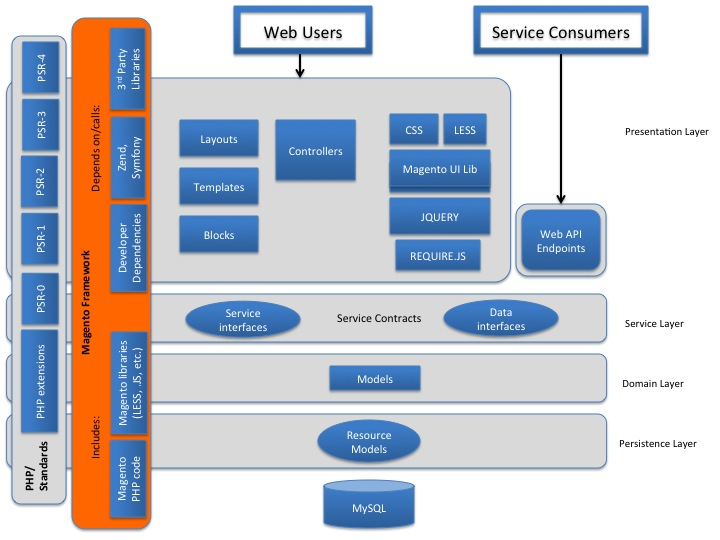

# Understanding the Platform Architecture
 - The Technology Stack [done]
 - The architectural layers [done]
 - The top-level filesystem structure [needReinforcement]

## The Technology Stack

### Reinforcement Reference:
 - [reinforcement] [Technology stack Magento official documentation](https://devdocs.magento.com/guides/v2.0/architecture/tech-stack.html)
 - [reinforcement] [The Holy Grail For Magento 2 Technology Stack by Wajid Hussain ](https://www.arpatech.com/blog/magento-2-technology-stack/)
 - [reinforcement] [PHP coding standard](https://devdocs.magento.com/guides/v2.2/coding-standards/code-standard-php.html)
 
## The architectural layers
 
### Reinforcement Reference:
  - [reinforcement] [Architecture Guide/Architectural layers overview](https://devdocs.magento.com/guides/v2.2/architecture/archi_perspectives/ALayers_intro.html)
  - [reinforcement] [Software Application N-tire (Layered) Architecture design pattern | Tutorial with example](https://www.youtube.com/watch?v=V4RDMV0L-JM)

## The top-level filesystem structure
 
### Reinforcement Reference:
  - [reinforcement] [Magento 2 Tutorial Lesson #3 Magento 2 Architecture and directory system](https://www.youtube.com/watch?v=unXrBVSZ7to) speed up the video to x1.5/x2